# GRC102 Security Governance Simulation
## Practical Lab 8 — Monitoring, Auditing Controls and Executive Reporting

**Student:** Imelda Sanya

**Registration Number:** C11/26/CGRCE/17576  
**Environment:** Local Docker-based ICDFA GRC102 Security Governance Lab  
**Reporting Date:** 7 October 2026

---

# Introduction

This practical lab was completed as a local security governance simulation. I built the environment with Docker on my Mac and used only synthetic data and containers created for the lab.

The purpose was not just to identify technical vulnerabilities. The main focus was to show how technical weaknesses can become governance problems when there is no effective patching process, monitoring, network separation, access control, or management follow-up.

The lab was completed in four parts:

1. Establish and assess the baseline environment.
2. Simulate a security incident and analyse the governance failures behind it.
3. Implement and verify security and governance controls.
4. Measure the results and present them in an executive format.

All testing was performed locally. No public systems, third-party systems, real customer information, or real credentials were used.

---

# Part 1 — Baseline Security and Governance Assessment

## 1.1 Lab Environment

The initial environment consisted of three Docker containers:

- `web_server` — the customer-facing application.
- `database_server` — MySQL containing synthetic customer data.
- `monitoring_server` — a separate container used for monitoring and security checks.

The application was based on an intentionally vulnerable Apache Struts version so that the lab could demonstrate how an identified vulnerability could become a governance issue.

The web application was exposed only on the local machine through:

`127.0.0.1:8080`

The database did not have a host port exposed.

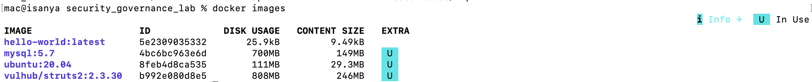

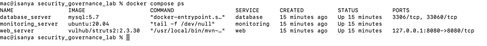

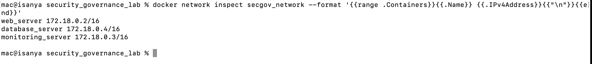

The initial environment used a shared Docker network. This was useful for demonstrating the baseline weakness because the monitoring container could reach the database service over TCP/3306.

---

## 1.2 Local Web Application Verification

The web application was checked locally to confirm that the lab environment was running.

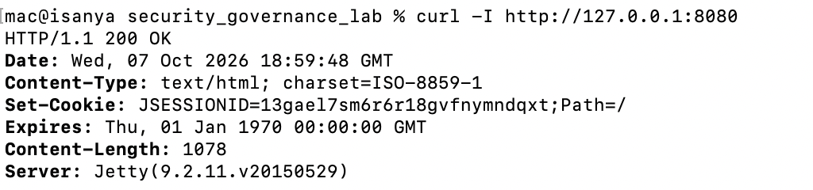

The application was deliberately kept local and was not exposed to the public internet.

---

## 1.3 Synthetic Database Verification

The database contained only synthetic records created for this exercise.

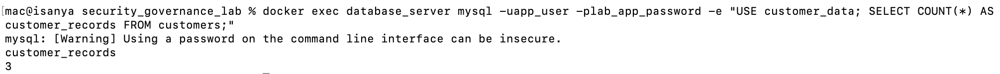

No real customer information was used.

---

## 1.4 Baseline Vulnerability Assessment

The baseline assessment identified Apache Struts S2-045 / CVE-2017-5638 as the main application vulnerability.

The scanner used a safe detection method and did not execute an actual Struts exploit.

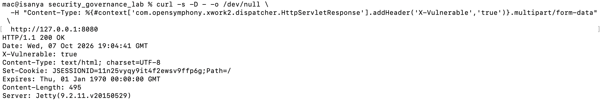

The baseline database assessment also showed that the application database account was configured with a broad host permission.

The account was initially:

`app_user@%`

This meant the account was not restricted to connections originating from the local database host.

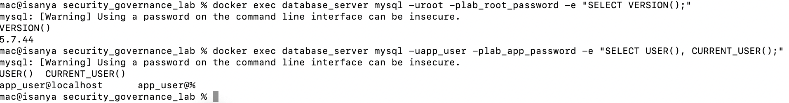

---

## 1.5 Baseline Network Reachability

The initial Docker network allowed the monitoring container to reach the database service on TCP/3306.

This was used as the baseline evidence for the network segmentation weakness.

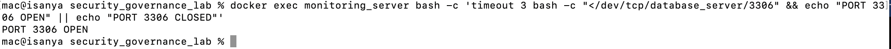

The important point here is that this evidence demonstrates monitoring-to-database reachability. It does not demonstrate that the web application could directly connect to the database.

---

## 1.6 Baseline Vulnerability Scanner Results

The vulnerability scanner was run against the local lab environment.

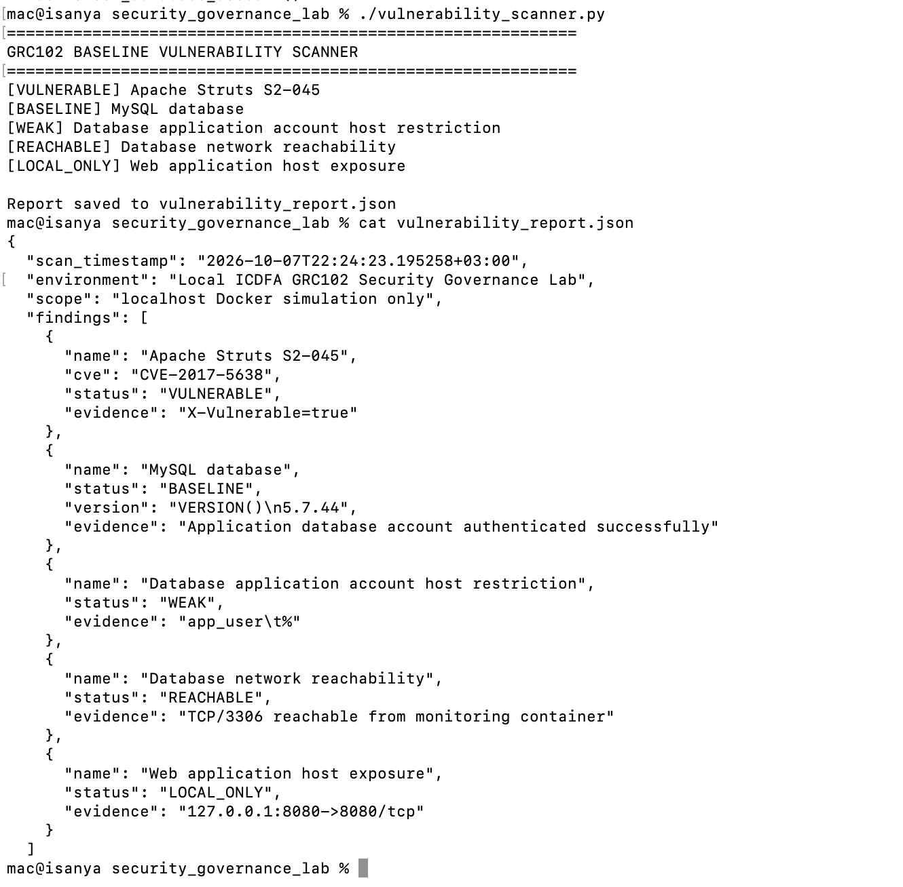

The baseline findings were used as the starting point for the governance assessment.

The main issues were:

- Vulnerable Apache Struts condition.
- Broad database application account host permission.
- Insufficient network separation between monitoring and database services.
- Lack of an implemented security monitoring control.
- Governance controls were still recorded as planned.

---

## 1.7 Baseline Governance Position

The governance tracker initially contained:

- 3 policies.
- 3 planned controls.
- 3 open risks.
- 1 security incident.
- 3 governance metrics.
- 1 audit record.

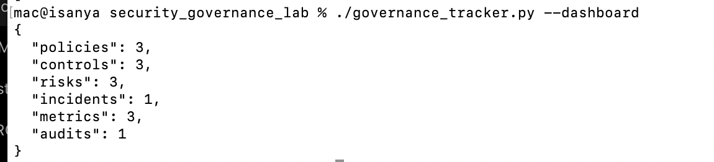

The baseline position showed that policies existed, but the technical controls needed to enforce those policies had not yet been implemented.

This was an important finding from the exercise. Having a policy recorded in a governance system does not by itself mean that the organisation is protected.

---

# Part 2 — Governance Failure Analysis

## 2.1 Safe Attack Simulation

A controlled simulation was performed against the local web application.

The simulation used a safe detection mechanism to represent the Struts S2-045 condition. No real exploit payload was executed.

The simulation recorded the possibility of application-level access to the synthetic customer database and three synthetic records were used for the exercise.

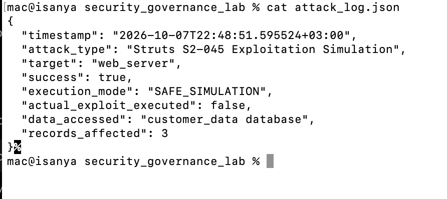

The `success` value in the simulation log represents successful completion of the simulation. It does not mean that a real exploit was executed.

The simulation explicitly records:

- `execution_mode: SAFE_SIMULATION`
- `actual_exploit_executed: false`
- Synthetic database used.
- Three synthetic records involved.

---

## 2.2 Governance Failures Identified

The governance analysis identified six areas where the technical weakness was connected to a governance weakness.

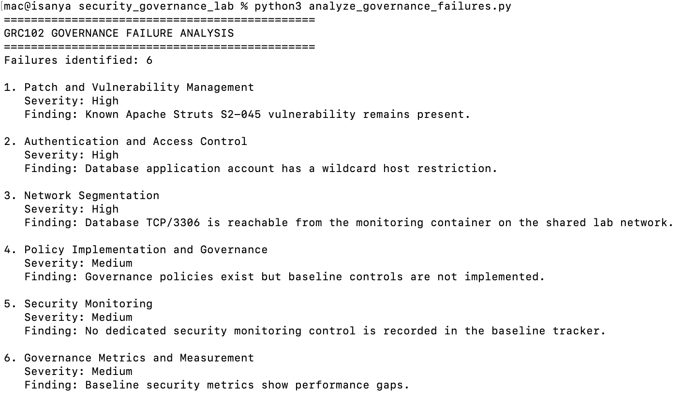

### 1. Patch and Vulnerability Management

The application was running a vulnerable Struts version even though the vulnerability was known.

The technical issue was therefore also a process issue. A vulnerability management process should identify, prioritise, assign and track remediation.

### 2. Authentication and Access Control

The database application account used a broad host definition:

`app_user@%`

This provided more access than was necessary for the application's intended use.

### 3. Network Segmentation

The monitoring container could reach the database network service.

The environment did not initially separate the front-end and database network paths sufficiently.

### 4. Policy Implementation

Policies had been recorded in the governance tracker, but the corresponding controls were still marked as planned.

This showed a gap between documented policy and actual implementation.

### 5. Security Monitoring

There was no implemented monitoring control at the beginning of the exercise.

This created a governance gap because management could not demonstrate that the environment was being actively checked for important security conditions.

### 6. Governance Metrics

The initial metrics did not show effective control performance.

This matters because management needs evidence that controls are operating, not simply evidence that policies exist.

---

# 2.3 Comparison With the Equifax Case

The lab scenario was designed around governance failures similar to those highlighted by the Equifax breach.

The comparison focused on the following areas:

| Area | Lab Simulation | Equifax Comparison |
|---|---|---|
| Patch management | Vulnerable Struts condition remained in the baseline | Known vulnerability was not remediated in time |
| Vulnerability management | Baseline vulnerability was identified but controls were initially planned | Vulnerability management and remediation processes failed |
| Monitoring | No monitoring control initially implemented | Breach activity was not detected for an extended period |
| Network segmentation | Monitoring-to-database reachability existed in the baseline | Weak segmentation contributed to the impact of the incident |
| Access control | Application database account had broad host permission | Access and security control weaknesses contributed to risk |
| Governance | Policies existed but implementation was incomplete | Accountability and oversight were important parts of the failure |
| Metrics | Baseline metrics showed weak control performance | Effective measurement and follow-up are important for management oversight |

The comparison is not intended to suggest that the lab environment reproduces the Equifax incident. The lab is a simplified local simulation used to demonstrate similar governance themes.

---

## 2.4 Lessons From Part 2

The main lesson from the simulation was that the vulnerability itself was only part of the problem.

A vulnerable component can remain in an environment because the organisation has weak processes around identification, ownership, prioritisation, remediation and verification.

The same applies to monitoring, access control and segmentation. These are not only technical configuration issues. They also need clear ownership, evidence, measurement and management follow-up.

---

# Part 3 — Security and Governance Control Implementation

The controls were implemented after the baseline assessment.

The purpose was to address the weaknesses identified in Parts 1 and 2 and then verify that the controls actually changed the security position.

---

## 3.1 Database Access Control

The baseline database account was:

`app_user@%`

The account was changed to:

`app_user@localhost`

The change was implemented through the database initialisation script so that the control is reproducible when the lab environment is rebuilt.

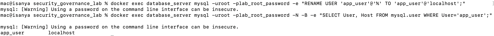

The verification confirmed that the application account was restricted to the local database host.

This control reduces unnecessary remote access to the application database account.

---

## 3.2 Network Segmentation

The Docker environment was redesigned using two networks:

- `frontend_network`
- `backend_network`

The current architecture is:

- `web_server` — connected to frontend and backend.
- `monitoring_server` — connected to frontend only.
- `database_server` — connected to backend only.

This means the monitoring container is no longer able to reach the database service directly.

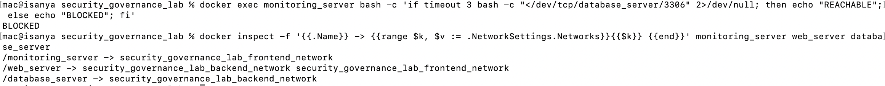

The control was verified by testing TCP/3306 from the monitoring container.

The result was:

`TCP/3306 not reachable`

This provided evidence that the intended network separation was working.

---

## 3.3 Patch Management

The vulnerable application image was replaced with a locally built image using Apache Struts 2.3.37.

The patched image was built from the original lab application and the Struts dependency was updated.

The purpose was to remove the baseline Struts S2-045 condition from the simulated environment.

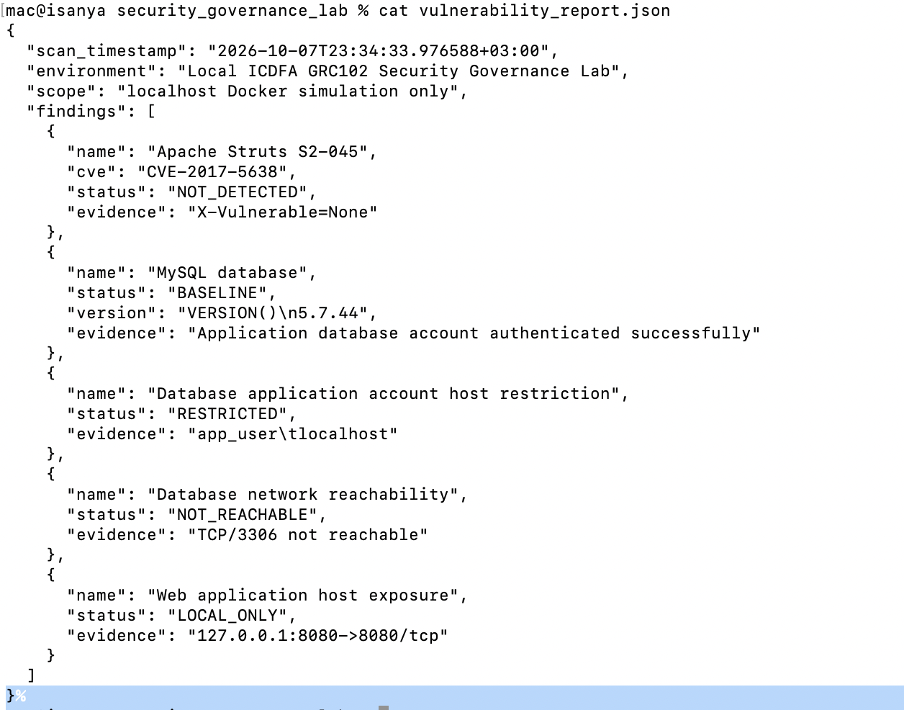

The post-control scanner no longer detected the baseline S2-045 condition.

This was verified using the same safe scanner method used during the baseline assessment.

---

## 3.4 Security Monitoring

A monitoring script was implemented to check:

- Whether the web application is reachable on TCP/8080.
- Whether the database is reachable from the monitoring container on TCP/3306.

The script records the results in:

`monitoring/security_monitor.log`

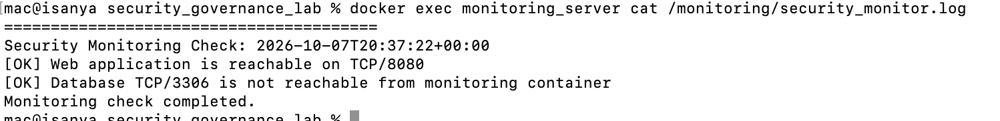

The monitoring control produced evidence showing that the database was not reachable from the monitoring container.

The monitoring implementation in this lab is a control demonstration rather than a full production monitoring platform. It was run on demand to produce evidence and logs for the exercise.

---

## 3.5 Governance Control Updates

The governance tracker was updated after the controls were implemented.

The following controls were marked as implemented:

- CTL-001 — Patch Management Process.
- CTL-002 — Vulnerability Scanning.
- CTL-003 — Incident Response Process.
- CTL-004 — Security Monitoring.

The three baseline risks were marked as mitigated.

The simulated incident was closed after the controls were verified.

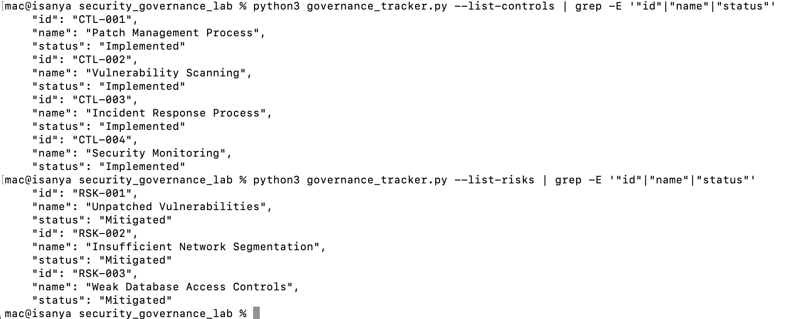

The incident resolution recorded that the Struts condition had been remediated and verified, while database access restriction and network segmentation had also been implemented and verified.

---

## 3.6 Post-Control Verification

The final verification confirmed the main control outcomes.

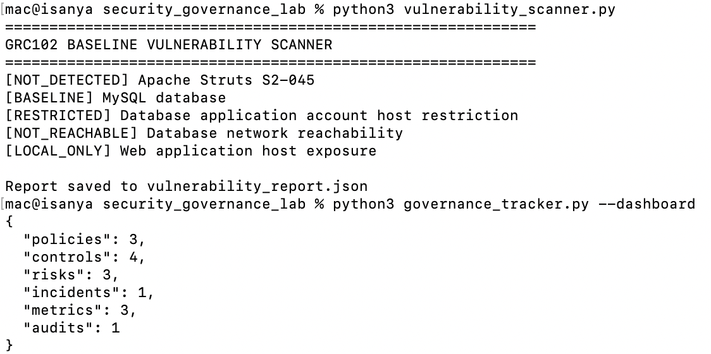

The key changes were:

| Area | Baseline | Post-Control |
|---|---|---|
| Struts S2-045 condition | Detected | Not detected |
| Database application account | `app_user@%` | `app_user@localhost` |
| Monitoring → Database TCP/3306 | Reachable | Not reachable |
| Web exposure | Local only | Local only |
| Governance controls | Planned | 4 implemented |
| Baseline risks | Open | 3 mitigated |
| Simulated incident | Open | Closed |

The exercise did not claim that every possible database or infrastructure security issue was eliminated. For example, the lab's root database account configuration was not used as evidence of complete database account hardening.

---

# Part 4 — Metrics and Executive Reporting

## 4.1 Metrics Framework

The metrics framework was designed around controls that could actually be demonstrated with evidence from the lab.

The framework measures:

1. Critical Vulnerability Status.
2. Database Access Control Compliance.
3. Network Segmentation Status.
4. Security Monitoring Coverage.
5. Governance Control Implementation.
6. Open Security Risks.

The metrics were deliberately based on the evidence available from the simulation.

I did not claim a 100% patch compliance figure because the lab did not contain enough data to support that claim.

---

## 4.2 Metrics Results

The metrics script produced six results.

| Metric | Result | Target | Status |
|---|---|---|---|
| Critical Vulnerability Status | NOT_DETECTED | NOT_DETECTED | PASS |
| Database Access Control | RESTRICTED | RESTRICTED | PASS |
| Database Network Isolation | NOT_REACHABLE | NOT_REACHABLE | PASS |
| Web Application Exposure | LOCAL_ONLY | LOCAL_ONLY | PASS |
| Governance Control Implementation | 4 | 4 | PASS |
| Baseline Risk Treatment | 3 | 3 | PASS |

The results were generated from the vulnerability scanner and governance tracker rather than manually entering the final values.

---

## 4.3 Executive Dashboard

The executive dashboard provides a management-level view of the control results.

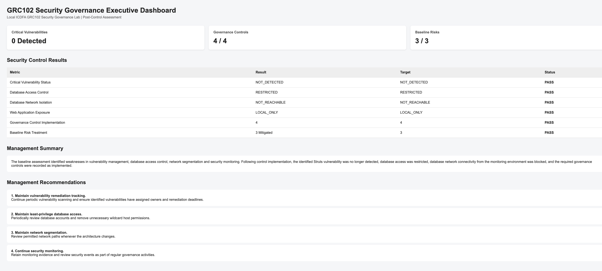

The dashboard shows:

- 0 critical vulnerabilities detected by the post-control scanner.
- 4 of 4 governance controls implemented.
- 3 of 3 baseline risks treated.
- The status and evidence for each control metric.

The dashboard is intended to give management a quick view of whether the controls demonstrated in the lab are operating as expected.

---

## 4.4 Control Outcomes Visualization

A separate visualization was created to compare the baseline position with the post-control position.

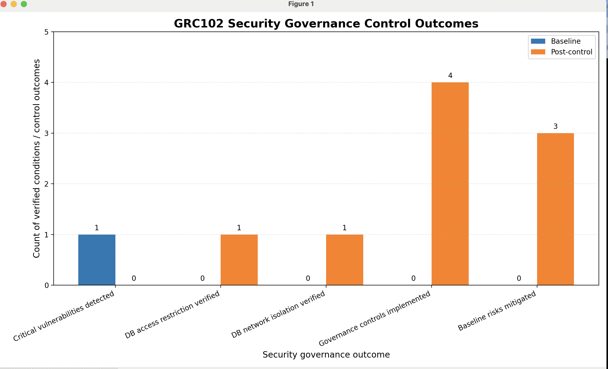

The visualization covers:

- Critical vulnerability detection.
- Database access restriction.
- Database network isolation.
- Governance controls implemented.
- Baseline risks mitigated.

The chart makes the change between the baseline and post-control states easier to see without requiring management to review the individual command outputs.

---

# 4.5 Board-Level Summary

## Executive Summary

The baseline assessment identified several governance weaknesses in the simulated environment. The main issues were a vulnerable Struts condition, broad database account permissions, insufficient network separation, and a lack of implemented monitoring controls.

Controls were then implemented and verified.

The application was rebuilt using a newer Struts dependency, the application database account was restricted to `localhost`, the Docker network was separated into frontend and backend networks, and a security monitoring script was introduced.

Post-control verification showed that the baseline Struts condition was no longer detected, the application database account was restricted, and monitoring could no longer reach the database on TCP/3306.

The governance tracker was also updated to show four implemented controls, three mitigated baseline risks, and closure of the simulated incident.

---

## Management Recommendations

Based on the exercise, the following actions would be appropriate in a real organisation:

### 1. Make vulnerability remediation measurable

Critical vulnerabilities should have an assigned owner, remediation deadline and verification step.

### 2. Restrict database access

Database accounts should use the minimum host and privilege scope required for their function.

### 3. Maintain network separation

Systems that do not require direct database access should not have a network path to the database.

### 4. Monitor important security conditions

Security monitoring should generate evidence that can be reviewed by security and management teams.

### 5. Link policies to implemented controls

A policy should not be considered effective simply because it exists in a policy repository. There should be evidence that the associated controls are implemented and operating.

### 6. Report control performance to management

Management reporting should focus on measurable control outcomes, risks and unresolved issues rather than only listing policies and technical activities.

---

# Conclusion

This practical lab demonstrated the relationship between technical security controls and information security governance.

The initial environment showed how a vulnerable application, broad database access and weak network separation can create governance risks when controls are not implemented and verified.

The second stage showed that the same weakness can be viewed from several governance perspectives: vulnerability management, access control, network security, monitoring, policy implementation and accountability.

The final stages demonstrated the importance of verification. Controls were not simply marked as complete. They were tested again after implementation.

The final results showed:

- The baseline Struts S2-045 condition was no longer detected.
- The application database account was restricted from `%` to `localhost`.
- Monitoring could no longer reach the database service on TCP/3306.
- Security monitoring produced evidence through a dedicated log.
- Four governance controls were marked as implemented.
- Three baseline risks were marked as mitigated.
- The simulated incident was closed.
- Six management-level metrics were generated.
- An executive dashboard and control-outcome visualization were produced.

The main lesson from the lab is that security governance needs evidence. A policy, risk register or control statement is useful, but it becomes much more meaningful when the organisation can show that the control was implemented, tested and measured.

---

# Evidence Appendix

## Part 1 — Baseline Evidence

1. P1-01 — Docker Images
2. P1-02 — Running Docker Containers
3. P1-03 — Docker Network
4. P1-04 — Local Web Application Verification
5. P1-05 — Synthetic Database Verification
6. P1-06 — Struts S2-045 Baseline Detection
7. P1-07 — Baseline Database Authentication
8. P1-08 — Baseline Database Network Reachability
9. P1-09 — Baseline Vulnerability Scanner Results
10. P1-10 — Baseline Governance Tracker Dashboard

## Part 2 — Governance Failure Evidence

11. P2-01 — Authorized Attack Simulation Log
12. P2-02 — Governance Failure Analysis

## Part 3 — Control Evidence

13. P3-01 — Database Access Control
14. P3-02 — Network Segmentation
15. P3-03 — Post-Control Vulnerability Verification
16. P3-04 — Security Monitoring
17. P3-05 — Governance Control Status
18. P3-06 — Final Post-Control Verification

## Part 4 — Executive Reporting Evidence

19. P4-01 — Executive Dashboard
20. P4-02 — Control Outcomes Visualization

---

# Key Repository Files

The main files supporting the assessment are:

- `docker-compose.yml`
- `Dockerfile.patched`
- `pom.xml`
- `database_init/init.sql`
- `database_init/02_harden_accounts.sql`
- `vulnerability_scanner.py`
- `simulate_attack.py`
- `analyze_governance_failures.py`
- `governance_tracker.py`
- `initialize_governance.py`
- `update_governance_controls.py`
- `metrics.py`
- `visualizations.py`
- `monitoring/security_monitor.sh`
- `vulnerability_report.json`
- `attack_log.json`
- `governance_failure_report.json`
- `governance_data.json`
- `metrics_report.json`
- `metrics_framework.md`
- `controls_report.md`
- `dashboard_guide.md`
- `executive_dashboard.html`
- `board_report.md`
- `control_outcomes_visualization.png`

---

# Final Statement

This lab was completed as an isolated security governance simulation using Docker and synthetic data.

The technical findings were used to demonstrate governance issues, implement controls, verify their effectiveness and produce evidence that could be presented to management.

The results show the importance of connecting security policies and risk management with actual technical controls, verification and measurable outcomes.
